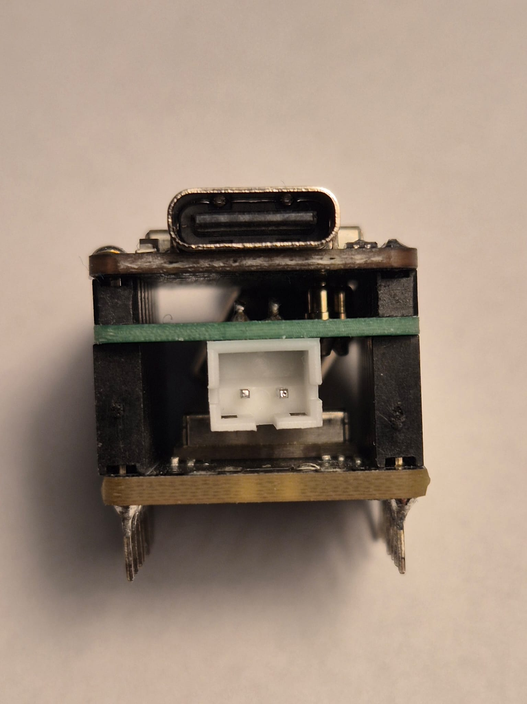
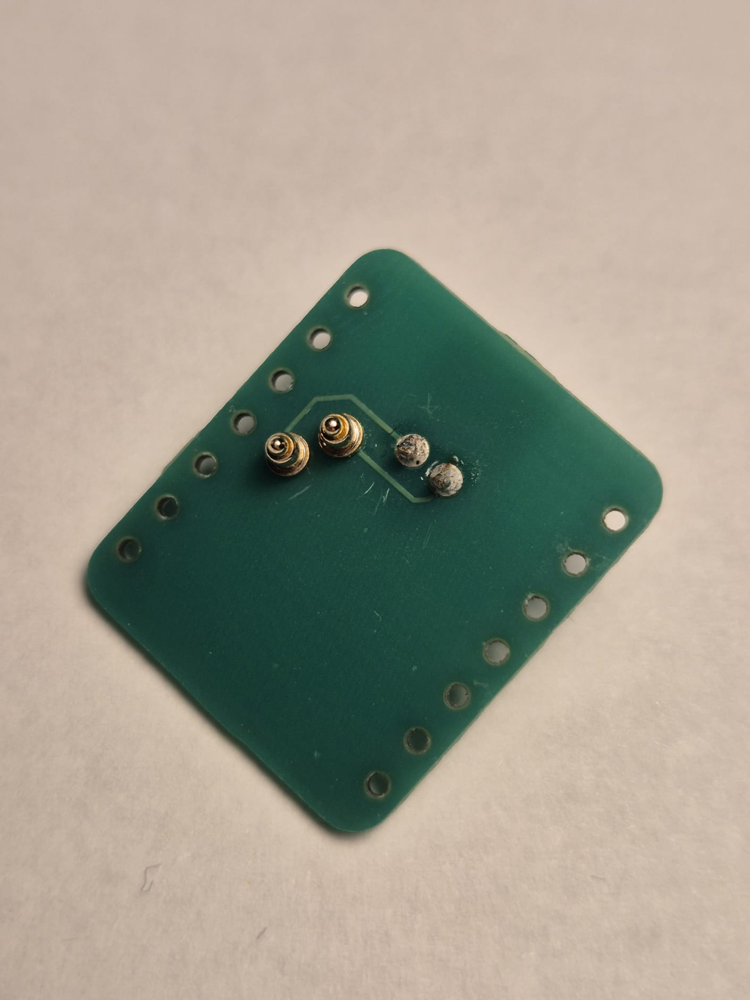
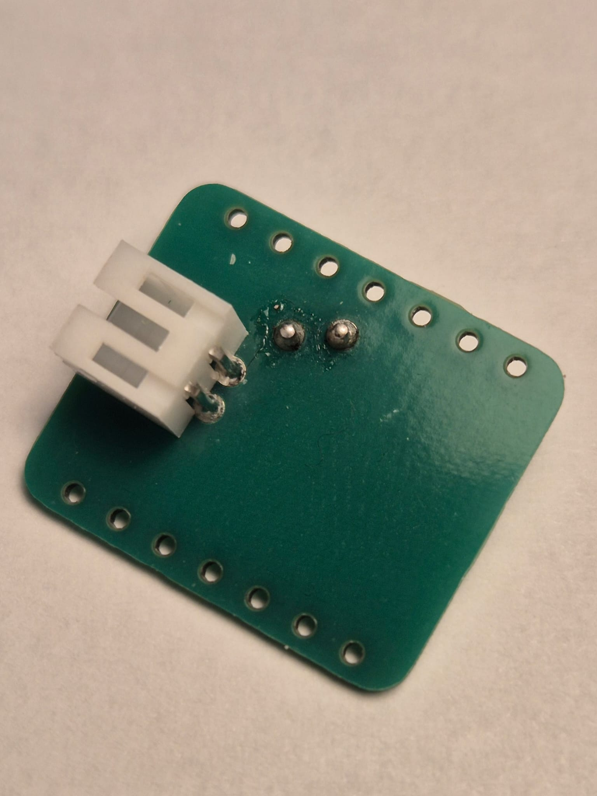

# Battery Extension Board for Seeed Studio XIAO nRF52840 & Wio-SX1262

Custom expansion board designed for the Seeed Studio XIAO nRF52840 paired with the Wio SX1262 LoRa module, tailored for Meshtastic deployments. 

## 🔋 Design Features
- **Modular Power**: Designed without a fixed, permanent battery so you can easily swap or service batteries in the field.
- **Standardized Pinout**: JST PH 2.0 battery connector polarity matches the **RAK 4630** standard for seamless battery cross-compatibility.
- **Pogo Pin Connections**: Utilizes 3.0mm DIP pogo pins for clean, reliable contact with the main module.

## 📸 Gallery

  
  
  

## 📋 Bill of Materials (BOM)

| Qty | Component / Description | Estimated Cost | Source / Links |
| :--- | :--- | :--- | :--- |
| 1x | Custom PCB | ~$3.00 / per 5 pcs (JLCPCB min. order) | [JLCPCB](https://jlcpcb.com) |
| 2x | Pogo Pins (3.0mm, DIP) | ~$0.30 / pc | [AliExpress Link](https://de.aliexpress.com/item/1005008633095807.html) |
| 1x | JST PH 2.0 Connector (2-Pin, 2.0mm pitch) | ~$0.02 / pc | [AliExpress Link](https://de.aliexpress.com/item/1005004955655144.html) |

## 📁 Repository Structure
- **`images/`** - Directory containing preview and layout gallery JPEGs.
- **`fabrication/`** - Production archive (`XIAO.zip`) containing Gerber and drill files ready for JLCPCB.
- **Root files** - KiCad schematic (`.kicad_sch`), PCB layout (`.kicad_pcb`), and project files.